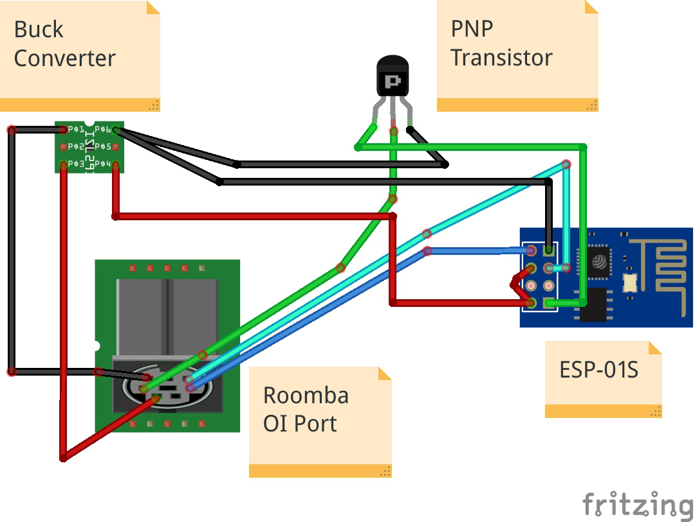

# iRobot® Roomba® 700
Smartify your iRobot® using an ESP-01S

# Features
- Detailed user config file (rename `config.h.example` to `config.h`)
- `DHCP` and `Static IP` support
- Ability to connect to a specific router using its `BSSID` (useful on a mesh network)
- OTA Updates
- Communicates over MQTT
- Ability to automatically reconnect to WiFi & MQTT
- Ability to wake the iRobot® up from normal & deep sleep
- Ability to command the iRobot® to start normal/spot/max cleaning / stop cleaning and go back to the dock
- Ability to set the iRobot®'s clock (automatically (on every restart or every 24 hours) and manually using an MQTT command) with DST support (Needs to be enabled in the config)
- Get a detailed charging status from the iRobot (if the `DEBUG` option is set to `true`)
- Ability to guess the iRobot®'s status (the [`Roomba® Open Interface (OI)`](./iRobot%20Roomba%20600%20Open%20Interface%20Spec.pdf) doesn't report cleaning status)
- Ability to report more advanced sensors (Battery temperature & voltage, General power usage, Motor currents, the value of the Virtual Wall sensor and which button is being pressed) (if the `SENSORS` option is set to `true`)
- Ability to report the full WiFi status (SSID, BSSID, Channel, RSSI and IP) (if the `WIFI_DEBUG` option is set to `true`)
- Ability to restart the `ESP` and the `iRobot®`
- Ability to power off the `iRobot®`
- Can be hooked into Home Assistant using only a `Template Vacuum` configuration

# Software Requirements
- Arduino IDE
- MQTT Broker

# Hardware Requirements
- iRobot® Roomba® 700 series
- A WiFi network
- ESP-01S
- FTDI Flasher
- Buck Converter (set it to `3.3v`)
- `2N3906` PNP Transistor

# Connection Diagram

# Credits
[thehookup](https://github.com/thehookup) - Original idea and [implementation](https://github.com/thehookup/MQTT-Roomba-ESP01)

[danielraq](https://github.com/danielraq) - Configuring the correct [normal wake up sequence](https://github.com/thehookup/MQTT-Roomba-ESP01/pull/3) for 700 series Roomba®s
